<h1 align="center">🐍 Phonebook Django 🐍<h1>

 
 
 

<ol>
    <li><a href="#topico1">Instalar/Configurar</a></li>
    <li><a href="#topico2">Settings</a></li>
    <li><a href="#topico3">Arquitetura MTV</a></li>
    <li><a href="#topico4">Models</a></li>
    <li><a href="#topico5">Admin</a></li>
    <li><a href="#topico6">Forms</a></li>
    <li><a href="#topico7">Templates</a></li>
    <li><a href="#topico8">Views</a></li>
    <li><a href="#topico9">Urls</a></li>
</ol>

 
 
 
<h2 align="center" id="topico1">🔷 Instalar/Configurar 🔷</h2>

 
🔹 Podemos começar a configurar o django criando um ambiente virtual com o seguinte comando:

    python3 -m venv .venv

 
 
🔹 Com a venv criada, devemos iniciá-la com o comando:

    . .venv/bin/activate

 
 
🔹 E, daí, instalar o Django:

    pip install django

 
 
🔹 Com o Django instalado, podemos dar início ao nosso projeto com o comando:

    django-admin startproject mysite .

É necessário incluir o ponto no fim do comando para que a estrutura de arquivos seja gerada no seu diretório atual.

 
 
🔹 Os comandos anteriores criam esta estrutura de diretórios:

 

    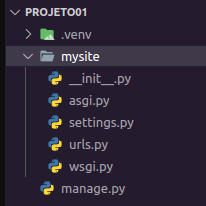

 
 
🔹 Para rodar o servidor de desenvolvimento, executamos o seguinte comando:

    python manage.py runserver

Executando o comando acima, você verá uma saída parecida com esta:

 

    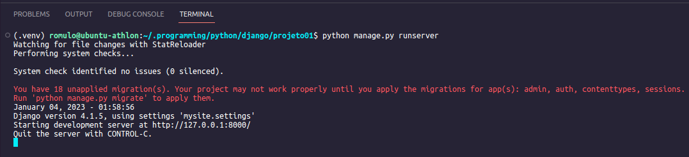

 
Com isso você pode visitar a página inicial do servidor de desenvolvimento pelo link: http://127.0.0.1:8000/

 
 
🔹 Para criar seu aplicativo, verifique se você está no mesmo diretório que o arquivo "manage.py" e digite o comando:

    python manage.py startapp phonebook

Note que "phonebook" é o nome da minha aplicação. Você deve substituí-lo pelo nome que desejar.

 
O Comando acima cria uma nova estrutura de diretórios:

 

    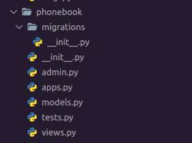

É essa estrutura que abrigará o seu aplicativo.

 
 
 
<h2 align="center" id="topico2">🔷 settings.py 🔷</h2>

 
 
🔹 Agora registre seu aplicativo no mysite/settings.py:

 

    

 
 
🔹 Aproveitando que estamos no arquivo settings.py, vamos aproveitar para configurar outras informações:

 
 
🔹 Timezone e linguagem são definidas no fim do arquivo.

 

    

Encontrei um repositório muito interessante que fala um pouco sobre o timezone, sem falar que no próprio arquivo há um link (possível ver no print acima) que leva a documentação oficial:

 
@marinho
 
🔗 https://github.com/marinho/aprendendo-django/blob/master/apendice-09-fusos-horarios.md

 
 
🔹 Para subir o projeto para o GitHub, criei um arquivo chamado testing.py e guardei lá algumas informações mais sensíveis — como a chave secreta e informações sobre o meu banco de dados. Então importei as variáveis que usaria do testing no início do settings.

 

    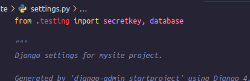

 
E ficaram assim:

 

    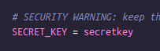
    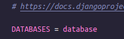

 
 
🔹 Para o meu banco de dados usei o MariaDB. Se você quiser usar o MariaDB ou MySQL, pode usar algo parecido com:

    DATABASES = {
        'default': {
            'ENGINE': 'django.db.backends.mysql',
            'NAME': 'seu_projeto',
            'USER': 'seu_usuário_do_banco_de_dados',
            'PASSWORD': 'sua_senha',
            'HOST': 'localhost',
            'PORT': '3306',
        }
    }

Mas é necessário instalar o driver mysqlclient que é uma interface para o servidor de banco de dados MySQL/MariaDB que fornece uma API do servidor de banco de dados Python.

    pip install mysqlclient

 
🔹 Para que o django também reconheça a pasta de templates, importei a biblioteca OS e fiz a seguinte modificação na lista TEMPLATES:

 

    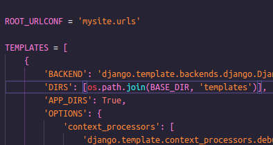

 
 
 
<h2 align="center" id="topico3">🔷 Arquitetura MTV 🔷</h2>

 
<h3 align="center">Model | Template | Views</h3>

 
O Model é o arquivo que contém a estrutura lógica do projeto e funciona como um intermediário para manipular dados entre o banco de dados e a View. Dentro do arquivo Model é determinado quais tipos de dados, como será armazenado dentro do seu banco e <b>como será exibido quando for requisitado pela View</b> (ou seja, o papel da view é formatar os dados que são vindos do banco através da Model para visualização). O model é a única e definitiva fonte de informações sobre seus dados. Ele contém os campos e comportamentos essenciais dos dados que você está armazenando. Django segue o princípio DRY (Don’t repeat yourself). O objetivo é definir o seu modelo de dados em um só lugar e automaticamente derivar coisas dele. O Template cuida da parte de visualização para o usuário final. Ele é como o front-end de sua aplicação. Nesta arquitetura, esta camada fica responsável por armazenar os arquivos html, css, javascript...

 
 
 
<h2 align="center" id="topico4">🔷 Models 🔷</h2>

 
🔹 Anteriormente vimos sobre os apps instalados. Antes de podermos utilizá-los devemos realizar as migrações das aplicações para o nosso banco de dados. Podemos fazer isso usando o seguinte comando:

    python manage.py migrate

 
🔹 Esse comando olha para o INSTALED_APPS e cria todas as tabelas necessárias no banco de dados de acordo com as configurações do arquivo settings.py. Com isso podemos ver a saída:

 

    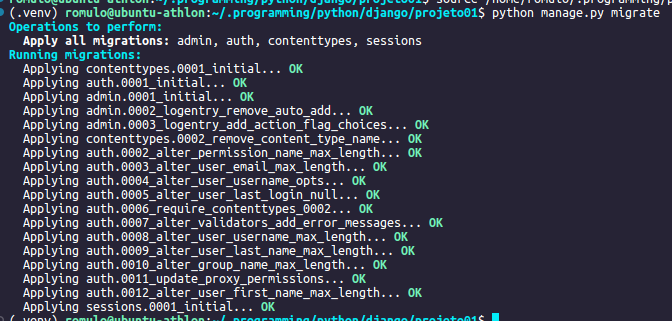

 
🔹 Agora vamos definir nossos models, o layout do banco de dados. Quero que minha aplicação guarde o nome, sobrenome, empresa, cargo, e-mail, telefone, aniversário e observação do contato. Alguns desses campos não são obrigatórios. Esses conceitos são representados por classes no python:

 

    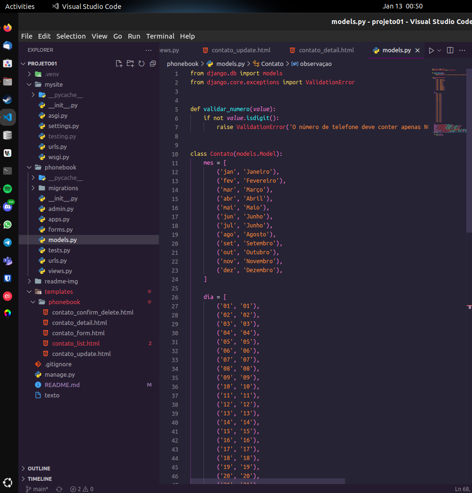

 
🔹 Você pode encontrar mais sobre models na documentação oficial do django:
 🔗 https://docs.djangoproject.com/pt-br/4.1/topics/db/models/

 
🔹 Após isso podemos informar ao Python que fizemos algumas mudanças nos nossos models e que gostaríamos que as informações fossem armazenadas como migrações. As migações são como o Python armazena as alterações em seus models.

    python manage.py makemigrations phonebook

 
🔹 Se você quiser ver o código sql das migrações, execute:

    python manage.py sqlmigrate phonebook 0001

 

    

 
🔹 Agora execute o seguinte comando para criar essas tabelas no seu banco de dados:

    python manage.py migrate

 
 
 
<h2 align="center" id="topico5">🔷 Admin 🔷</h2>

 
🔹 Agora devemos criar nosso usuário administrador:

    python manage.py createsuperuser

 
🔹 Digite o nome de usuário desejado e pressione enter. Em seguida, você será solicitado a fornecer o endereço de e-mail desejado. A etapa final é inserir sua senha. Você será solicitado a inserir seu senha duas vezes, a segunda vez como uma confirmação da primeira.

 
🔹 Inicie o servidor de desenvolvimento:

    python manage.py runserver

 
🔹 Agora abra o link e entre como administrador: http://127.0.0.1:8000/admin/

 

    

 
🔹 E esta seá a tela após a autenticação:

 

    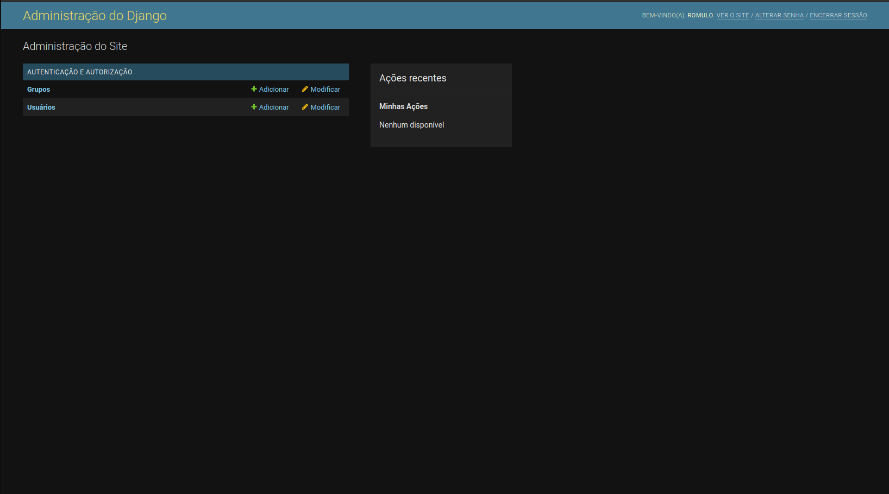

 
🔹 Para que o nosso aplicativo apareça na interface de admin, precisamos modificar o arquivo phonebook/admin.py:

 

    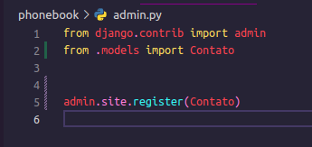

 
🔹 Agora a opção da nossa model já aparece na interface:

 

    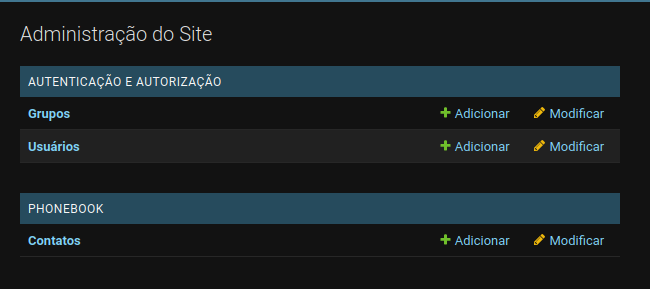

 
🔹 Clique em contatos e você poderá ver uma tela parecida com esta:

 

    

 
🔹 Dai no canto superior direito há um botão "adicionar contato". Clique nele e você poderá preencher as informações:

 

    

 
🔹 Após a adição do contato:

 

    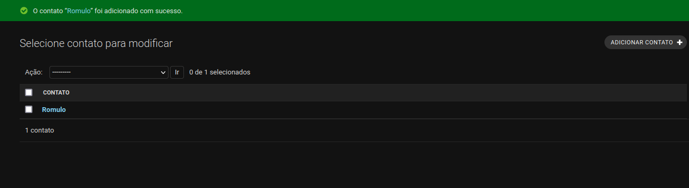

 
🔹 Também é possível editar o contato:

 

    

 
🔹 Você pode encontrar mais sobre admin na documentação oficial do django:
 🔗 https://docs.djangoproject.com/pt-br/4.1/ref/contrib/admin/

 
🔹 Como os unicos campos requeridos são o nome e o número de telefone, resolvi criar uma pequena validação para o número. Atualizando o arquivo phonebook/models.py:

 

    

 
🔹 Caso queira criar essa validação, deve executar o <code>makemigration</code> e <code>migrate</code> novamente. Assim fica a interface de administrador quando o usuário tenta inserir caracteres não numéricos:

 

    

 
🔹 Você pode encontrar mais sobre validações na documentação oficial do django:
 🔗 https://docs.djangoproject.com/en/4.1/ref/validators/

 
 
 
<h2 align="center" id="topico6">🔷 Forms 🔷</h2>

 
🔹 Em HTML, um formulário é uma coleção de elementos dentro da tag <code>forms</code> que permitir que um visitante faça coisas como inserir texto, selecionar opções, manipular objetos ou controles, e assim por diante, e depois enviar essas informações de volta para o servidor.

 
🔹 Agora que vamos trabalhar com os forms na nossa aplicação, devemos começar criando um arquivo no diretório da aplicação com o nome forms.py e o editamos da seguinte forma:

 

    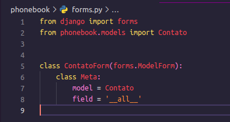

 
🔹 Você pode encontrar mais sobre forms na documentação oficial do django:
 🔗 https://docs.djangoproject.com/en/4.1/topics/forms/

 
 
 
<h2 align="center" id="topico7">🔷 Templates 🔷</h2>

 
🔹 Para começarmos a trabalhar com os <a href="#templates">templates</a> você deve ter configurado o settings como foi passado anteriormente.

 
🔹 Agora crie um diretório chamado "templates" e um subdiretório com o nome da sua aplicação.

 
🔹 O django tem um modelo de criação de arquivos html dentro da pasta templates. Você pode criar desta forma: "nome-do-model" + "_" + "tipo-da-função".html

Ex.: contato_list.html

 
🔹 Você pode encontrar mais sobre templates na documentação oficial do django:
 🔗 https://docs.djangoproject.com/en/4.1/#the-template-layer
 🔗 https://docs.djangoproject.com/en/4.1/topics/templates/

 
 
 
<h2 align="center" id="topico8">🔷 Views 🔷</h2>

 
🔹 Nesta aplicação, viso exercitar o CRUD (create, read, update and delete). Como na interface administrativa eu já havia criado um contato, comecei a criar as views pelo "read". Fica algo parecido com:

 

    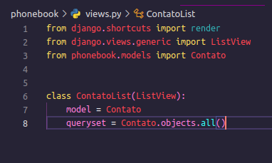

 
🔹 Você pode encontrar mais sobre views na documentação oficial do django:
 🔗 https://docs.djangoproject.com/en/4.1/#the-view-layer
 🔗 https://docs.djangoproject.com/en/4.1/ref/class-based-views/

 
 
 
<h2 align="center" id="topico9">🔷 URL's 🔷</h2>

 
🔹 Para trabalhar com as URL's, devemos criar um arquivo phonebook/urls.py e importá-la no mysite/urls.py:

 

    

